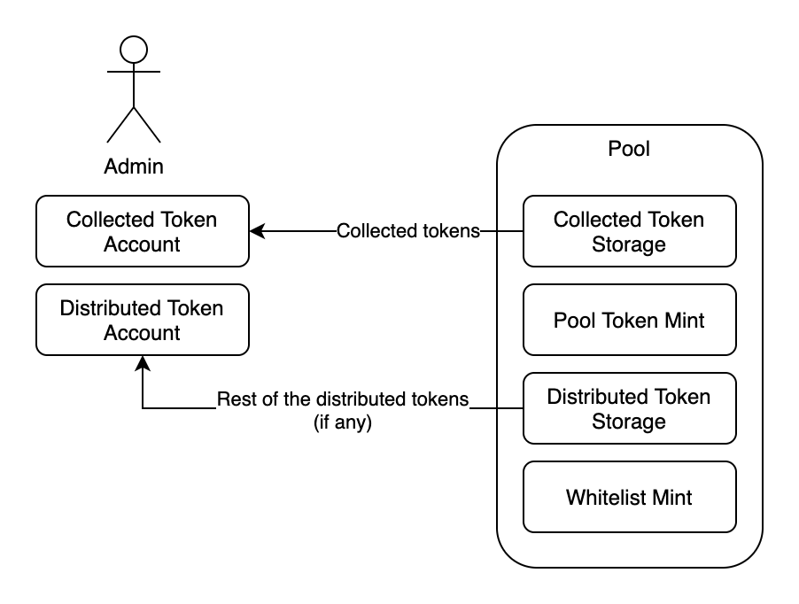

# SolStarter Architecture

## Terms

SolStarter works with the following entities:

- **Market** is a group of pools.
- **Pool** is a campaign to sell tokens, with rate, goal, min/max investment etc.
- **Collected Token** in the context of a particular pool is the token being collected (participants pay it to buy other tokens).
- **Distributed Token** is the token being sold in the pool.
- **Pool Token** is a temporary token issued after the user sent in the collected token, but before the pool collection interval is over, it is used later to claim distributed tokens or refund collected tokens (if the pool does not reach its goal).
- **Whitelist Token** is a symbolic token issued by the pool owner to the participants if the pool is created with a whitelisting option. In this case this token is burned during the pool sale.

Additionally each created pool can have the following characteristics:

- **Price** is how much each distributed token is worth in collected tokens (price * collected = distributed).
- **Goal** is the minimum and maximum amount to collect in the pool. If the minimum amount is not collected the collected token will be refunded. If the maximum amount is collected the tokensale stops.
- **Amount** is the minimum and maximum amount to invest by a single user.
- **Time** is the start and finish time of the pool. Before start time no collected tokens are received from the users. Between start and finish active sale is going on until the goal is reached. And after the finish time users can collect their tokens.

## Flow

### Initialization
 

First pool admin initializes the pool and distributed tokens are deposited to its token address.

 

If the pool is whitelist-based pool admin triggers minting of pool tokens to the whitelisted users.

### Active stage

 

Users participate in the token sale by sending collected tokens and receiving fresh minted pool tokens in return.

 

If there is a whitelist for the pool the users also have to burn their whitelist tokens as a proof of participation in the whitelist.

### After pool is closed

 

Once the pool collection interval is over the collected token amount has reached its goal then users can burn their pool tokens and receive distributed tokens from the pool in return.

 

However if the pool did not meet its goal then the users can use the same pool tokens to refund the tokens they sent to the pool.

 

And finally the pool admin can withdraw all the funds from the collection token account as well as unsold tokens from the distribution token account.

## Know your customer

KYC (know your customer) is a way to restrict IDOs only to the users with known identities. This will involve users sending scans of their documents, verifying them, etc, but this does not concern us. What we need to do is to store a flag for the particular IDO market / user combination, identifying the fact that this user has finished KYC successfully. We could have used a non-transferrable token for this purpose, but KYC should be able to expire and SPL tokens do not support expiration.  KYC is market-wide, not specific to a specific IDO pool.

